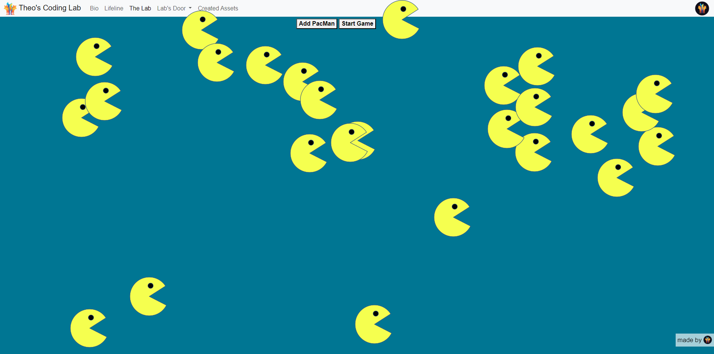

#  Title of the project: Pacmen

## Description of the project:

  This project involves a Factory for making Pacmen who will move around the 
page, there's array of pacmen, which keeps track of the position and velocity 
of each pacman.
 
## How to Use:
  When the "make one" button is pressed the pacmen will appear, they will 
move around the page and bounce off any wall on contact.

## Roadmap of future improvements: 
  I would possibly change this project by creating little fruits on screen 
that disapear, maybe with a 'pop' sound or visual effect once the a pacmen 
overlaps with them.

## Appearance:

## License information: 

MIT License

Copyright (c) 2023 Theo Bueno

Permission is hereby granted, free of charge, to any person obtaining a copy
of this software and associated documentation files (the "Software"), to deal
in the Software without restriction, including without limitation the rights
to use, copy, modify, merge, publish, distribute, sublicense, and/or sell
copies of the Software, and to permit persons to whom the Software is
furnished to do so, subject to the following conditions:

The above copyright notice and this permission notice shall be included in all
copies or substantial portions of the Software.

THE SOFTWARE IS PROVIDED "AS IS", WITHOUT WARRANTY OF ANY KIND, EXPRESS OR
IMPLIED, INCLUDING BUT NOT LIMITED TO THE WARRANTIES OF MERCHANTABILITY,
FITNESS FOR A PARTICULAR PURPOSE AND NONINFRINGEMENT. IN NO EVENT SHALL THE
AUTHORS OR COPYRIGHT HOLDERS BE LIABLE FOR ANY CLAIM, DAMAGES OR OTHER
LIABILITY, WHETHER IN AN ACTION OF CONTRACT, TORT OR OTHERWISE, ARISING FROM,
OUT OF OR IN CONNECTION WITH THE SOFTWARE OR THE USE OR OTHER DEALINGS IN THE
SOFTWARE.

<Add it to your code: https://opensource.org/license/mit/>